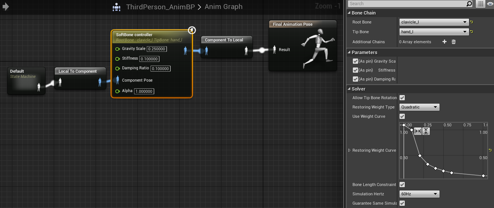
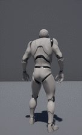

# Softbone Plugin

소프트본 컨트롤러는 지글본으로 구성된 본 체인에 적용할 수 있습니다. 

이 플러그인은 더 이상 업데이트를 지원하지 않습니다. 

대신 엔진 기본 기능인 AnimDynamics 를 사용해주시기 바랍니다. 

런처 버전 엔진 사용자는 아래 파일을 다운로드 받아서 사용하실 수 있습니다.

[4.16 - SoftBone4.16.zip](https://github.com/EGKSupport/SoftbonePlugin/raw/4.16/SoftBone4.16.zip) 

[4.22 버전 SoftBone4.22.zip](https://github.com/EGKSupport/SoftbonePlugin/raw/4.22/SoftBone4.22.zip)

SoftBone controller is for a bone chain composed of jiggle bones. 

This plugin is no longer updated. 

Please use Anim Dynamics, Engine default feature.

## Supported Platforms

이 플러그인의 최종 업데이트는 4.22 용으로 수정되었습니다.

모든 플랫폼에서 동작할 것으로 예상됩니다.

This plug-in was last built against **Unreal Engine 4.22**. 

It works on all platforms (probably).

## Usage

Bone Chain 에 하나의 체인을 추가하고

같은 속성을 가지는 다른 체인들은 Accitional Chains에 추가할 수 있습니다.

Solver에 설정과 노드의 입력값에 따라 체인의 반응을 설정할 수 있습니다.

Add target chain to Bone Chain

Chains that have same settings can be added to Additional Chains.

You can set behavior of chains using Solver settings in details panel and input through pins.

## Support

**Note: This plugin is not supported by Epic Games.**

이 플러그인은 사용 편의를 위해 소스 코드를 제공해 드리지만
추후 업데이트가 예정되어 있지 않습니다.

This plug-in is shared for ease of use
but further update is not planned.

## References

* [애님 다이내믹스](https://docs.unrealengine.com/ko/Engine/Animation/NodeReference/SkeletalControls/AnimDynamics/index.html)
* [Anim Dynamics](https://docs.unrealengine.com/en-US/Engine/Animation/NodeReference/SkeletalControls/AnimDynamics/index.html)
* [리짓 바디](https://docs.unrealengine.com/ko/Engine/Animation/NodeReference/SkeletalControls/RigidBody/index.html)
* [Rigid Body](https://docs.unrealengine.com/en-US/Engine/Animation/NodeReference/SkeletalControls/RigidBody/index.html)
